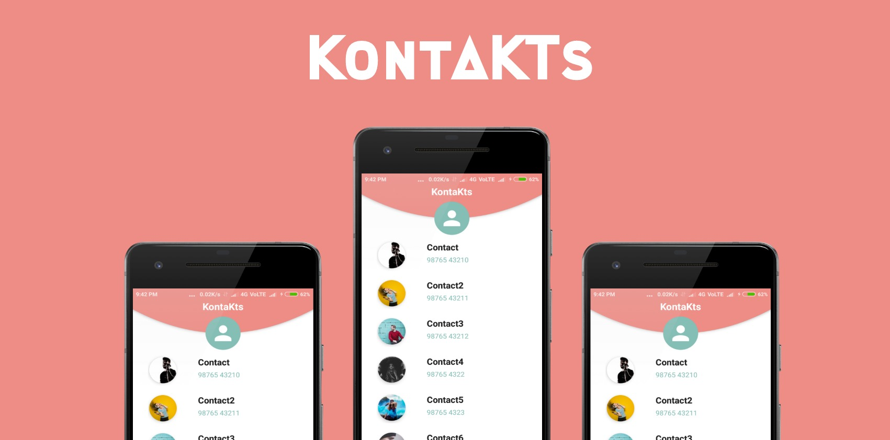
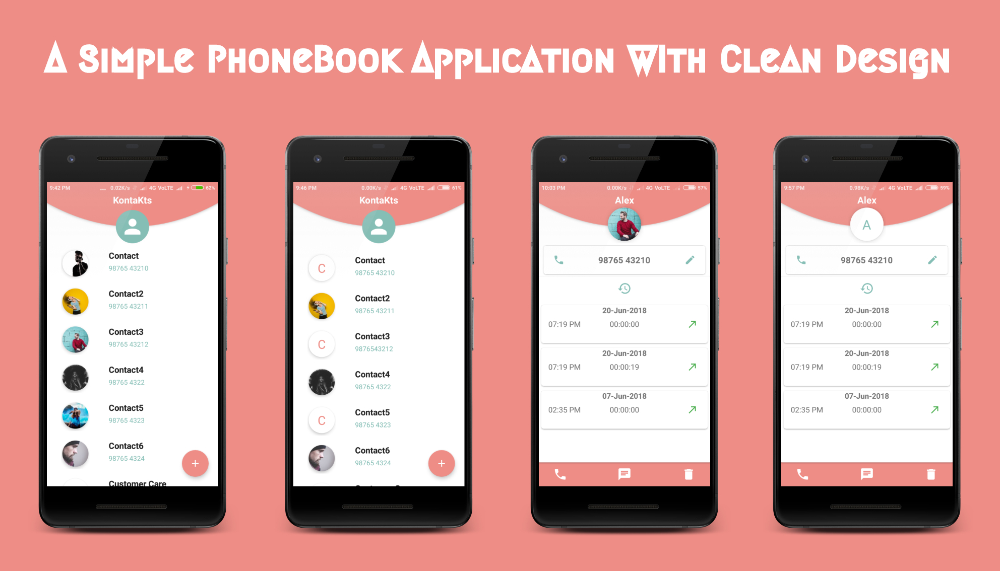

 

# Description

Kontackts is a simple phonebook Android application with a clean and simple design. It's a beginner friendly project with a clean code implementing some android basics like Cursor Loader, Loader Manager, RecyclerView and how content resolver, Shared element transition works.  
It allow user to edit, delete, add contact through application and call, message feature is given which call phone default functions and shows user call logs for a particular number.

# Libraries Used

  * ButterKnife
  * Picasso
  * PermissionDispatcher (For requesting permissions)
  * hdodenhof/CircleImageView
  * florent37/ShapeOfView (Best Library for custom shape views)
 
 # What you will learn?
 
 This is a beginner friendly project so it will be easy to understand how things are working in this project.
 Make sure you know some basics of Android Development before download/clone/fork.  
 ### This project will help in understanding following Android fundamentals topic:
  
   1. Loader Mange 
   2. Cursor Loader
   3. Content Resolver 
   4. Complex RecyclerView
   5. Shared Element Transition
   6. Permission Dispatcher
  

# Screenshots

 

# Contribute

Feel free to fork this project, and add new feature and design.
 
Then make a merge-request after updated the README with a sample of your design, include all screenshot and try to go with this color palette only.

#  Acknowledgement

1. Thanks for these two user of dribble for the application UI design idea

 * [Asif Kilwani](https://dribbble.com/shots/4724732-P2C-Refer-To-Friends)

 * [Kate Ivanova](https://dribbble.com/shots/4619243-Daily-UI-013-Direct-Messaging)

2. [florent37 for the shape of view](https://github.com/florent37/ShapeOfView)

3. [Stackoverflow for all answer](www.stackoverflow.com)

4. [CodePath Android Cliffnotes](https://guides.codepath.com/android)

